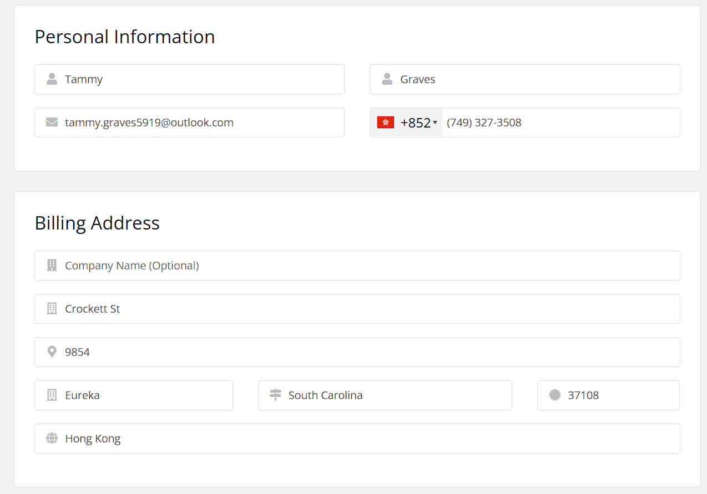

### 自动填写表单脚本（Tampermonkey）

该脚本可以自动填充注册表单，使用随机的个人信息。它会检测页面上是否存在注册表单，并在右上角显示确认窗口，用户确认后自动填写表单，内容包括姓名、邮箱、电话、地址等信息。




---

### 功能：
- 自动检测并填充注册表单。
- 使用公共 API (`randomuser.me`) 生成随机的用户信息。
- 页面右上角显示确认窗口，要求用户确认后再填充表单。
- 支持自定义字段（例如，姓名、邮箱、电话、地址等）。
- 支持配置随机邮箱的格式
- 使用 `localStorage` 保持设置，跨浏览器会话中保留配置。

---

### 安装步骤：

1. **安装 Tampermonkey**：
   - 前往 [Tampermonkey 官网](https://www.tampermonkey.net/) 安装插件。
   - 安装完成后，浏览器的工具栏中会显示 Tampermonkey 图标。

2. **创建新脚本**：
   - 点击 Tampermonkey 图标，选择 **Create a new script**。
   - 在弹出的编辑窗口中，粘贴下面提供的完整脚本。

3. **保存脚本**：
   - 点击 **File > Save** 或直接按 `Ctrl + S` 保存脚本。

4. **激活脚本**：
   - 脚本保存后会自动激活，匹配所有符合的网页（`@match http://*/*` 和 `@match https://*/*`）。

---

### 如何使用：

1. 访问包含注册表单的网页（包含姓名、邮箱、地址等字段）。
2. 页面右上角会显示一个浮动输入框。
3. 输入一个用户名（如果为空，默认使用 `user`）。
4. 点击 **“填写”** 按钮，表单会自动填充随机数据。
5. 如果想关闭浮动窗口，点击 **“关闭”** 按钮，脚本将记住关闭状态，避免下次再次弹出。

---

### 邮箱自定义说明

在本脚本中，邮箱生成的方式是通过用户名（`username`）和随机数字组合而成，生成的邮箱格式是：`username + 随机数字 + @域名`。其中，用户可以根据自己的需求修改随机数的位数和邮箱的域名。

---

### 配置邮箱的两项自定义：
1. **修改随机数位数 (`randomDigits`)**：
   - 脚本会生成一个随机的数字，位数由 `randomDigits` 变量控制。例如，如果你设置为 `4`，则生成的随机数字会是 4 位数。你可以根据需求更改此数字的位数。

2. **修改邮箱的域名 (`emailSuffix`)**：
   - 邮箱的域名部分默认是 `@example.com`，你可以将其修改为任何有效的域名。例如，修改为 `@outlook.com` 或者 `@gmail.com` 等。只需在 `emailSuffix` 变量中设置你希望使用的邮箱域名即可。

---

### 配置方法：

在脚本中找到以下两行：

```javascript
// 修改为需要的随机数位数
var randomDigits = 4;  // 随机数字的位数

// 修改为邮箱域名
var emailSuffix = 'outlook.com';  // 你希望使用的邮箱域名
```

- **`randomDigits`**: 修改为你需要的随机数位数。比如，如果你需要生成一个包含 6 位数字的邮箱，就将 `4` 改为 `6`。
  
- **`emailSuffix`**: 修改为你需要的邮箱域名。例如，如果你希望所有的邮箱都为 `outlook.com`，可以设置为 `outlook.com`，如果需要其他域名，只需替换该值。

---

### 示例：

假设你将配置如下：

```javascript
var randomDigits = 6;  // 邮箱的随机数字为 6 位
var emailSuffix = 'gmail.com';  // 使用 gmail.com 作为域名
```

那么脚本会生成类似以下格式的邮箱：

```
user123456@gmail.com
```

